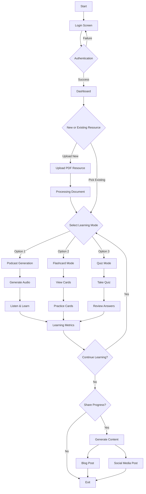

# LearnLab 🎓

[](https://www.python.org/downloads/)
[](https://fastapi.tiangolo.com/)
[](https://nextjs.org/)
[](https://www.docker.com/)
[](LICENSE)
[](https://github.com/psf/black)
[](https://codelabs-preview.appspot.com/?file_id=1kMzJ_qRJrDknPFatF1raPvsoJUatl_-tfJuICo7p4EM#0)

> Enhancing Learning with Fun, Interactive Journeys for Better Comprehension, Revision, and Evaluation.

## 🌟 Quick Links

- [GitHub Issues and Tasks](https://github.com/orgs/DAMG7245-Big-Data-Sys-SEC-02-Fall24/projects/7/views/1)
- [Codelabs Documentation](https://codelabs-preview.appspot.com/?file_id=1kMzJ_qRJrDknPFatF1raPvsoJUatl_-tfJuICo7p4EM#0)
- [Project Submission Video](https://drive.google.com/drive/u/0/folders/1wgYeUY-HsDuWcqGq1hSNVRQ3gvQBMLZC)

## 👥 Team

- Sai Surya Madhav Rebbapragada
- Uday Kiran Dasari (Project Manager)
- Venkat Akash Varun Pemmaraju

## 🎯 Overview

In today's digital learning landscape, there's a growing need for tools that can transform static PDF documents into diverse, interactive learning materials. LearnLab addresses this challenge by providing an intelligent platform that converts PDFs into multiple engaging formats, including audio podcasts, flashcards, and quizzes.

## 🚀 Features

- **📱 Interactive Dashboard**
- User authentication
- PDF upload and management
- Learning progress tracking

- **🎧 Podcast Generation**
- Automated conversion of academic content
- Engaging audio narratives
- Text-to-speech optimization

- **📝 Flashcards**
- AI-powered concept extraction
- Spaced repetition system
- Customizable difficulty levels

- **📊 Interactive Quizzes**
- Dynamic question generation
- Real-time feedback
- Performance analytics

- **📝 Content Transformation**
- Blog post generation
- Social media integration
- Citation management

## 🛠️ Technology Stack

### Backend
- 
- 
- 
- 

### Frontend
- 
- 
- 

### AI/ML
- 
- LangChain
- LlamaIndex
- Docling

### Cloud & DevOps
- 
- 
- 
- 
- 

## 🏗️ Architecture

### User Flow


## 📋 Project Timeline

- **Phase 1** (Nov 24 - Nov 28): Project setup and infrastructure
- **Phase 2** (Nov 29 - Dec 3): Core feature development
- **Phase 3** (Dec 4 - Dec 8): Integration and testing
- **Phase 4** (Dec 9 - Dec 12): Optimization and refinement
- **Phase 5** (Dec 13 - Dec 14): Final deployment and documentation

## 🚀 Getting Started

### Prerequisites
- Python 3.9+
- Node.js 16+
- Docker
- GCP Account
- AWS Account


1. **Setup Environment:**
```bash
# Clone repository
git clone <repository-url>
cd LearnLab

# Initialize environments and configurations
./setup-env.sh
```

2. **Start Services:**
```bash
# Start all services
docker-compose up -d

# Or start specific services
docker-compose up -d frontend backend
```

## Service Ports

| Service   | Port  | URL                     |
|-----------|-------|-------------------------|
| Frontend  | 3000  | http://localhost:3000   |
| Backend   | 8000  | http://localhost:8000   |
| Streamlit | 8501  | http://localhost:8501   |
| Airflow   | 8080  | http://localhost:8080   |
| Database  | 5432  | postgres://localhost:5432|

## Essential Commands

### Development
```bash
# Build specific service
docker-compose build <service-name>

# View logs
docker-compose logs -f <service-name>

# Restart service
docker-compose restart <service-name>
```

### Database
```bash
# Access PostgreSQL CLI
docker-compose exec db psql -U postgres

# Backup database
docker-compose exec db pg_dump -U postgres learnlab > backup.sql
```

### Cleanup
```bash
# Stop all services
docker-compose down

# Remove volumes
docker-compose down -v
```

## Project Structure
```
LearnLab/
├── frontend/          # Next.js frontend
├── backend/          # FastAPI backend
├── streamlit-ui/     # Streamlit analytics
├── airflow/          # Airflow DAGs
├── docker/           # Docker configurations
└── docker-compose.yml
```

## Technology Stack

### Core Services
- **Frontend**: Next.js 15.0.3, TypeScript, TailwindCSS
- **Backend**: FastAPI, SQLAlchemy, Poetry
- **Analytics**: Streamlit, Plotly, Pandas
- **Pipeline**: Apache Airflow 2.7.3
- **Database**: PostgreSQL 15

### Infrastructure
- Docker & Docker Compose
- Python 3.9.6
- Node.js 18
- Poetry for Python dependency management

## Development State

### Completed
- Base service setup with Docker
- Inter-service communication
- Database initialization
- Hot-reload development setup
- Health checks implementation

### In Progress
- API development
- Frontend components
- Data pipeline implementation
- Analytics dashboard

## Environment Setup
Each service requires its own `.env` file. Copy from `.env.example`:

```bash
cd <service-directory>
cp .env.example .env
```

For detailed service-specific documentation, refer to each service's README:
- [Frontend Documentation](frontend/README.md)
- [Backend Documentation](backend/README.md)
- [Streamlit UI Documentation](streamlit-ui/README.md)
- [Airflow Documentation](airflow/README.md)


## 📜 License

This project is licensed under the MIT License - see the [LICENSE](LICENSE) file for details.

## 🔗 References

- [OpenNotebookLM](https://github.com/gabrielchua/open-notebooklm)
- [Bark](https://github.com/suno-ai/bark)
- [Llama Recipes](https://github.com/meta-llama/llama-recipes)
- [EduChain](https://github.com/satvik314/educhain)
- [Consillium App](https://www.consillium.app/)
- [Median](https://github.com/5uru/Median)
