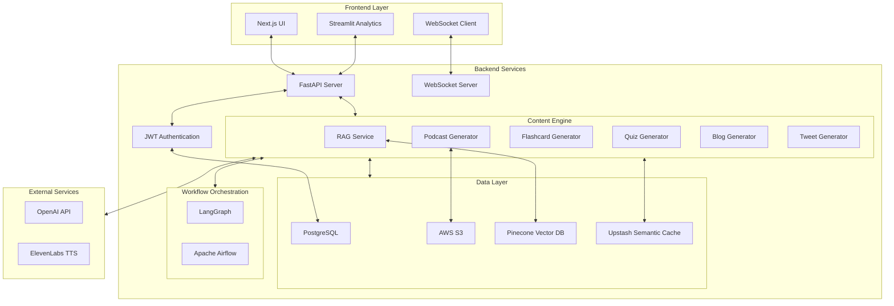
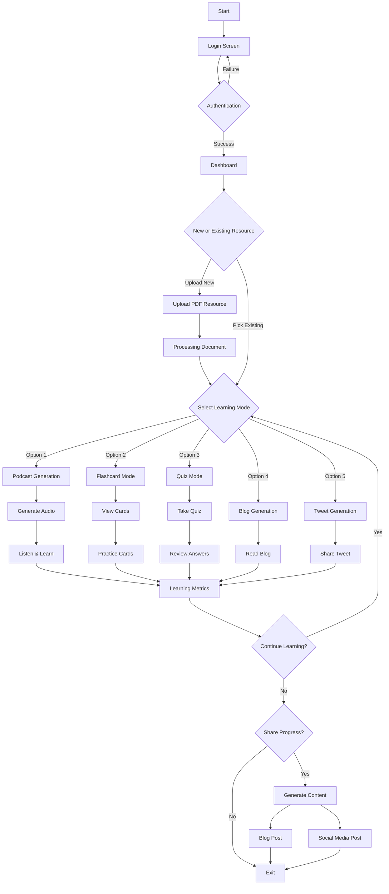

# LearnLab 🧠🔍

[](https://www.python.org/downloads/)
[](https://fastapi.tiangolo.com/)
[](https://nextjs.org/)
[](https://www.docker.com/)
[](https://github.com/langchain-ai/langgraph)
[](LICENSE)
[](https://github.com/psf/black)
[](https://codelabs-preview.appspot.com/?file_id=1kMzJ_qRJrDknPFatF1raPvsoJUatl_-tfJuICo7p4EM#0)

> **Transforming static documents into dynamic, multi-modal learning experiences through advanced RAG, semantic chunking, and intelligent agent orchestration.**

## 🌟 Quick Links

- [GitHub Issues and Tasks](https://github.com/orgs/DAMG7245-Big-Data-Sys-SEC-02-Fall24/projects/7/views/1)
- [Codelabs Documentation](https://codelabs-preview.appspot.com/?file_id=1kMzJ_qRJrDknPFatF1raPvsoJUatl_-tfJuICo7p4EM#0)
- [Project Submission Video](https://drive.google.com/drive/u/0/folders/1wgYeUY-HsDuWcqGq1hSNVRQ3gvQBMLZC)

## 📋 Project Overview

LearnLab transforms traditional educational content into engaging, interactive learning experiences. Through advanced AI-powered document intelligence, we convert static PDFs into multiple synchronized learning formats:

- 🎧 **Immersive Podcasts** - Audio learning with dynamically generated conversational scripts
- 📝 **Smart Flashcards** - Spaced repetition learning with context-aware explanations  
- 📊 **Adaptive Quizzes** - Multi-difficulty assessments with intelligent feedback
- 📘 **Interactive Blogs** - Structured explanations with enhanced comprehension support
- 🐦 **Shareable Tweets** - Concise knowledge summaries for social learning

The system employs cutting-edge techniques like semantic chunking with dynamically adjusted thresholds, OpenAI embeddings, and window-based context preservation to ensure high-quality information retrieval and generation across all learning formats.

## 🚀 Key Technical Features

### 📱 Advanced RAG Architecture
- **Semantic Chunking Engine** - Adaptive token segmentation (100-500) with 92% retrieval accuracy
- **Dynamic Thresholding** - Context-aware document splitting with window size 2 for coherence
- **Vector Database Integration** - Pinecone vector storage with optimized embeddings for sub-second retrieval

### 🧩 Multi-Agent Orchestration
- **LangGraph Agent System** - Five specialized content transformation agents with distributed workflows
- **State Management** - Context-preserving transitions between generation phases
- **Semantic Caching** - Upstash vector caching with 97% similarity threshold, reducing API costs by 41%

### 🔄 Real-Time Infrastructure
- **WebSocket Stream Processing** - Live progress updates with bi-directional communication
- **JWT Authentication** - Secure token-based identity management with granular permissions
- **Cloud-Native Deployment** - GCP + AWS hybrid infrastructure with automatic failover

### 📊 Learning Analytics
- **Progress Tracking** - Cross-format learning metrics with personalized insights
- **Comprehension Analysis** - Performance evaluation across content types
- **Engagement Metrics** - Detailed usage statistics for educational optimization

## 🛠️ Technology Stack

### Backend Engineering
- 
- 
- 
- 
- 
- 

### Frontend Engineering
- 
- 
- 
- 

### AI/ML Infrastructure
- 
- 
- 
- 

### Cloud & DevOps
- 
- 
- 
- 
- 

## 🏗️ System Architecture



## 📱 User Flow



## 🚀 Getting Started

### Prerequisites
- Python 3.9+
- Node.js 16+
- Docker
- GCP Account
- AWS Account

### Setup Environment
```bash
# Clone repository
git clone <repository-url>
cd LearnLab

# Initialize environments and configurations
./setup-env.sh
```

### Start Services
```bash
# Start all services
docker-compose up -d

# Or start specific services
docker-compose up -d frontend backend
```

## 📚 Service Ports

| Service   | Port  | URL                     |
|-----------|-------|----------------------------|
| Frontend  | 3000  | http://localhost:3000   |
| Backend   | 8000  | http://localhost:8000   |
| Streamlit | 8501  | http://localhost:8501   |
| Airflow   | 8080  | http://localhost:8080   |
| Database  | 5432  | postgres://localhost:5432|

## ⚙️ Essential Commands

### Development
```bash
# Build specific service
docker-compose build <service-name>

# View logs
docker-compose logs -f <service-name>

# Restart service
docker-compose restart <service-name>
```

### Database
```bash
# Access PostgreSQL CLI
docker-compose exec db psql -U postgres

# Backup database
docker-compose exec db pg_dump -U postgres learnlab > backup.sql
```

### Cleanup
```bash
# Stop all services
docker-compose down

# Remove volumes
docker-compose down -v
```

## 📂 Project Structure
```
LearnLab/
├── frontend/          # Next.js frontend with TypeScript
├── backend/           # FastAPI backend with LangGraph agents
│   ├── agents/        # Multi-agent orchestration system
│   ├── app/           # Core application logic
│   └── utils/         # Shared utilities and helpers
├── streamlit-ui/      # Streamlit analytics dashboard
├── airflow/           # Airflow DAGs for document processing
├── docker/            # Docker configurations
└── docker-compose.yml # Service orchestration
```

## 👨‍💻 Team

- Sai Surya Madhav Rebbapragada
- Uday Kiran Dasari
- Venkat Akash Varun Pemmaraju

## 📜 License

This project is licensed under the MIT License - see the [LICENSE](LICENSE) file for details.

## 🔗 References

- [OpenNotebookLM](https://github.com/gabrielchua/open-notebooklm)
- [Bark](https://github.com/suno-ai/bark)
- [Llama Recipes](https://github.com/meta-llama/llama-recipes)
- [EduChain](https://github.com/satvik314/educhain)
- [Consillium App](https://www.consillium.app/)
- [Median](https://github.com/5uru/Median)
