# LearnLab 🧠✨
<div align="center">

 **AI-powered platform transforming static PDFs into podcasts, flashcards, quizzes, blogs, and tweets through intelligent agent orchestration and semantic document processing.**


</div>

---

## 📋 Table of Contents

- [Overview](#-overview)
- [What It Does](#-what-it-does)
- [Performance Achievements](#-performance-achievements)
- [System Architecture](#️-system-architecture)
- [Agent Orchestration](#-agent-orchestration)
- [Key Technical Features](#-key-technical-features)
- [Repository Structure](#-repository-structure)
- [Data Pipeline](#-data-pipeline)
- [Technology Stack](#️-technology-stack)
- [Resources](#-resources)

---

## 🎯 Overview

LearnLab is an **AI-agent orchestrated educational platform** that converts PDF documents into five distinct learning formats. The system reduced content generation time by 78% (6-9 minutes to under 2 minutes), improved RAG retrieval accuracy from 60% to 92%, and cut API costs by 41% through intelligent semantic caching.

Built on LangGraph multi-agent workflows, semantic-router chunking, and deployed across GCP Cloud SQL and AWS S3, LearnLab demonstrates production-grade performance optimization and cost-effective AI operations.

**Target Users:** Students seeking active recall tools, educators creating engaging content, professionals extracting knowledge from technical documents, and content creators needing automated multi-format generation.

**[Live Demo](https://drive.google.com/drive/u/0/folders/1wgYeUY-HsDuWcqGq1hSNVRQ3gvQBMLZC) • [Documentation](https://codelabs-preview.appspot.com/?file_id=1kMzJ_qRJrDknPFatF1raPvsoJUatl_-tfJuICo7p4EM#0) • [Project Board](https://github.com/orgs/DAMG7245-Big-Data-Sys-SEC-02-Fall24/projects/7/views/1)**

---

## 🚀 What It Does

### **Five Content Formats from One PDF**

| Format | Generation Time | Key Feature |
|--------|----------------|-------------|
| 🎧 **Podcast** | 90-120s (new) / <2s (cached) | Two-voice conversational audio with ElevenLabs TTS |
| 📝 **Flashcards** | 10-15s (new) / 3-5s (cached) | SuperMemo SM-2 spaced repetition with progress tracking |
| 📊 **Quiz** | 20-30s (new) / 5-8s (cached) | Multi-difficulty assessment with detailed feedback |
| 📘 **Blog** | 12-20s | SEO-optimized structured content with sections |
| 🐦 **Tweet** | 4-6s | Concise summaries for social media sharing |

### **How It Works**

1. **Upload PDF** → Airflow ETL pipeline processes document (text extraction → semantic chunking → embedding generation → Pinecone indexing)
2. **Ask Question** → RAG retrieves relevant chunks from vector database with 92% accuracy
3. **Select Format** → LangGraph routes to specialized agent (podcast/flashcard/quiz/blog/tweet)
4. **Get Content** → Generated content delivered via WebSocket with real-time progress updates

Semantic caching checks for similar queries first (97% similarity threshold), returning cached results in under 2 seconds when available.

---

## 📊 Performance Achievements

### **Measured Improvements**

| Metric | Before | After | Method |
|--------|--------|-------|--------|
| **Content Generation** | 6-9 minutes | <2 minutes | Semantic caching (Upstash Vector) |
| **RAG Accuracy** | 60% | 92% | Semantic-router dynamic chunking |
| **API Costs** | $1.51/generation | $0.91/generation | 35-45% cache hit rate |
| **Query Latency** | 2.5-3.5s | 0.8-1.2s | Pinecone indexing + caching |

---

## 🏗️ System Architecture


### **Architecture Layers**

**Client Layer** handles user interactions through Next.js 15 with React 19, providing responsive UI and real-time updates via WebSocket connections.

**API Layer** manages request routing, authentication via JWT tokens with refresh token rotation, and WebSocket-based notification delivery with offline queuing support.

**Agent Orchestration** coordinates five specialized content generation agents through LangGraph's state machine, enabling parallel processing and conditional workflow routing based on user-selected output format.

**RAG Pipeline** processes documents through semantic chunking (semantic-router library), generates embeddings via OpenAI's text-embedding-3-small model, and stores vectors in Pinecone for rapid similarity search.

**Caching Layer** uses Upstash vector-based semantic caching with 97% similarity threshold to eliminate redundant API calls, reducing costs by 41% while maintaining generation quality.

**Data Layer** spans Google Cloud SQL for PostgreSQL (user data, sessions, progress tracking) and AWS S3 for media files (podcasts, PDFs).

**ETL Pipeline** runs on Apache Airflow with daily scheduled ingestion plus on-demand triggering from API, processing new PDFs through a 5-stage pipeline from S3 scan to Pinecone indexing.

## 🔄 User Journey

```mermaid
flowchart TD
    Start([👤 User Arrives]) --> Auth{Authenticated?}
    Auth -->|No| Login[🔐 Login/Register]
    Auth -->|Yes| Dashboard[📊 Dashboard]
    Login --> Dashboard
    
    Dashboard --> Choice{Action?}
    
    Choice -->|Upload New| Upload[📤 Upload PDF]
    Choice -->|Use Existing| Library[📚 Document Library]
    
    Upload --> Process[⚙️ Processing Document]
    Process --> ETL[🔄 Airflow ETL Pipeline]
    ETL --> Indexed[✅ Document Indexed]
    Indexed --> Select
    
    Library --> Select[📄 Select Document]
    
    Select --> Format{Choose Format}
    
    Format -->|Podcast| CheckCache1{Cache Hit?}
    CheckCache1 -->|Yes| PlayCached[▶️ Play Audio<br/>1-2 seconds]
    CheckCache1 -->|No| GenPodcast[🎧 Generate Podcast<br/>90-120 seconds]
    GenPodcast --> PlayNew[▶️ Play New Audio]
    PlayCached --> Metrics
    PlayNew --> Metrics
    
    Format -->|Flashcards| CheckCache2{Cache Hit?}
    CheckCache2 -->|Yes| StudyCached[📝 Study Cards<br/>3-5 seconds]
    CheckCache2 -->|No| GenFlash[📝 Generate Cards<br/>10-15 seconds]
    GenFlash --> StudyNew[📝 Study New Cards]
    StudyCached --> Metrics
    StudyNew --> Metrics
    
    Format -->|Quiz| GenQuiz[📊 Generate Quiz<br/>20-30 seconds]
    GenQuiz --> TakeQuiz[✏️ Take Quiz]
    TakeQuiz --> Review[📈 Review Results]
    Review --> Metrics
    
    Format -->|Blog| GenBlog[📘 Generate Blog<br/>12-20 seconds]
    GenBlog --> ReadBlog[📖 Read Blog]
    ReadBlog --> Metrics
    
    Format -->|Tweet| GenTweet[🐦 Generate Tweet<br/>4-6 seconds]
    GenTweet --> ShareTweet[📤 View/Share Tweet]
    ShareTweet --> Metrics
    
    Metrics[📊 Update Analytics] --> Continue{Continue?}
    Continue -->|Yes| Format
    Continue -->|No| End([👋 Exit])
    
    style Start fill:#4CAF50,stroke:#2E7D32,stroke-width:3px,color:#fff
    style Dashboard fill:#2196F3,stroke:#1565C0,stroke-width:2px,color:#fff
    style Process fill:#FF9800,stroke:#E65100,stroke-width:2px,color:#fff
    style ETL fill:#9C27B0,stroke:#6A1B9A,stroke-width:2px,color:#fff
    style GenPodcast fill:#F44336,stroke:#C62828,stroke-width:2px,color:#fff
    style GenFlash fill:#FF5722,stroke:#D84315,stroke-width:2px,color:#fff
    style GenQuiz fill:#795548,stroke:#4E342E,stroke-width:2px,color:#fff
    style Metrics fill:#009688,stroke:#00695C,stroke-width:2px,color:#fff
    style End fill:#607D8B,stroke:#37474F,stroke-width:3px,color:#fff
```



### **User Flow Highlights**

- **Intelligent Caching:** Reduces repeat generation times by 78% (6-9min → <2min for podcasts)
- **Real-time Progress:** WebSocket notifications keep users informed during generation
- **Seamless Experience:** Automatic format switching with context preservation
- **Analytics Integration:** All interactions tracked for personalized insights

---

## 🤖 Agent Orchestration


### **LangGraph Multi-Agent System**

LearnLab implements a **state-based agent coordination system** where five specialized agents share context and execute conditionally based on user-selected output format.

**Agent Workflow:**
1. **Content Router** examines output type (podcast/flashcard/quiz/blog/tweet) and directs to appropriate path
2. **Cache Checker** (podcast only) queries Upstash for semantically similar past generations
3. **RAG Retriever** fetches top-3 relevant chunks from Pinecone with context window expansion
4. **Specialized Agent** generates content using format-specific prompts and validation
5. **Storage Handler** saves to PostgreSQL/S3 and updates cache for future queries

**State Management:**

Shared `EnhancedGraphState` object maintains:
- Conversation history between agents
- RAG context (question, answer, evidence chunks)
- PDF metadata and document title
- Cache status and S3 URLs
- Generated content for each format
- Current processing stage for progress tracking

This architecture enables **parallel content generation**, **error recovery** at any stage, and **context preservation** across agent transitions.

---

## 🔬 Key Technical Features

### **1. Semantic Document Chunking**

Uses **semantic-router library (Aurelio Labs)** with RollingWindowSplitter for dynamic chunking.

**How it works:** Analyzes semantic similarity between sentences using a sliding window (size 2). When similarity drops below a percentile-based threshold, creates a chunk boundary. This preserves complete thoughts and maintains context coherence.

**Configuration:**
- Dynamic thresholding: Adapts to content density
- Token range: 100-500 (prevents fragmentation)
- Window size: 2 (maintains narrative flow)

**Impact:** Improved retrieval accuracy from 60% to 92% by respecting document structure instead of arbitrary token boundaries.

### **2. Vector-Based Semantic Caching**

Upstash Vector stores complete generation outputs indexed by query embeddings.

**Cache Strategy:** Generate embedding for user query → Search for similar vectors (>97% similarity) → Return cached result if found → Otherwise generate and cache new content.

**Cost Savings:** 
- Cache hit: $0.01 (vector lookup only)
- Cache miss: $1.51 (OpenAI + Gemini + ElevenLabs APIs)
- 40% hit rate: Weighted average $1.51 → $0.91 = **41% cost reduction**

### **3. Multi-Cloud Deployment**

| Component | Platform | Service | Purpose |
|-----------|----------|---------|---------|
| **Application** | GCP | Compute Engine | FastAPI + Next.js containers via Docker Compose |
| **Database** | GCP | Cloud SQL | PostgreSQL 15 managed service |
| **Media Storage** | AWS | S3 | Podcast audio files and PDFs |

**Deployment:** Docker images built via GitHub Actions → Pushed to DockerHub → Pulled on GCP Compute Engine → Orchestrated with docker-compose.

### **4. Apache Airflow ETL Pipeline**

**5-Stage Pipeline:**
- **Initialize:** Setup Pinecone connection and validate credentials
- **Scan:** Detect new PDFs in S3 bucket and download to Airflow workspace
- **Process:** Extract text with PyPDF2 and parse document metadata
- **Embeddings:** Generate vectors in batches of 128 using OpenAI API
- **Upload:** Upsert vectors to Pinecone with chunk metadata

**Execution:** Runs daily at midnight + triggers on-demand when users upload PDFs via API.

### **5. Real-Time WebSocket Notifications**

**Features:**
- Connection pooling (multiple sessions per user)
- Offline message queue (stores notifications when disconnected)
- Automatic delivery on reconnection
- Retry logic with exponential backoff

**Use Cases:** Progress updates during 90-120s podcast generation, completion notifications, ETL pipeline status.

### **6. JWT Authentication**

| Token Type | Lifetime | Storage | Purpose |
|-----------|----------|---------|---------|
| Access Token | 30 minutes | Client memory | API authentication |
| Refresh Token | 7 days | Database + Client | Token renewal |

**Security:** Refresh token rotation on every renewal prevents replay attacks. Database session tracking enables selective revocation.

---

## 📁 Repository Structure

```
LearnLab/
├── frontend/                    # Next.js 15 + React 19 + TypeScript
│   ├── app/                     # App router with dynamic routes
│   │   ├── dashboard/           # Main UI (files, podcasts, flashcards, quizzes)
│   │   └── auth/                # Login and registration
│   ├── components/              # React components (UI, podcast, flashcard, quiz)
│   ├── store/                   # Zustand state management
│   └── lib/                     # Utilities and API client
│
├── backend/                     # FastAPI + Python 3.12
│   ├── agents/                  # LangGraph orchestration
│   │   ├── podcast_agent/       # Main agent (learn_lab_assistant_agent.py)
│   │   ├── tools/               # Web search integration
│   │   └── utils/               # RAG, caching, generation agents
│   │       ├── rag_application.py
│   │       ├── pdf_processor.py
│   │       ├── upstash_cache.py
│   │       ├── podcast_s3_storage.py
│   │       ├── flashcard_agent.py
│   │       ├── qna_agent.py
│   │       ├── blog_agent.py
│   │       └── tweet_agent.py
│   ├── app/                     # FastAPI application
│   │   ├── api/v1/              # REST endpoints (auth, files, podcasts, quizzes)
│   │   ├── core/                # Config, database, security, health checks
│   │   ├── models/              # SQLAlchemy models
│   │   ├── schemas/             # Pydantic validation schemas
│   │   └── services/            # Business logic (notification, podcast, quiz, flashcard)
│   └── tests/                   # Pytest test suite
│
├── airflow/                     # ETL pipeline
│   ├── dags/                    # DAG definitions
│   │   ├── pdf_processing_dag.py
│   │   └── tasks/               # 5-stage pipeline (initialize, scan, process, embed, upload)
│   └── scripts/                 # PDF processor and S3 helper
│
├── docker/postgres/             # Database initialization scripts
├── .github/workflows/           # CI/CD (test, build, push to DockerHub)
├── assets/                      # Documentation images
└── docker-compose.yml           # Development + production configs
```

---

## 🤖 Agent Orchestration


### **LangGraph Multi-Agent System**

LearnLab implements a **state-based agent coordination system** where five specialized agents share context and execute conditionally based on user-selected output format.

**Agent Workflow:**
1. **Content Router** examines output type (podcast/flashcard/quiz/blog/tweet) and directs to appropriate path
2. **Cache Checker** (podcast only) queries Upstash for semantically similar past generations
3. **RAG Retriever** fetches top-3 relevant chunks from Pinecone with context window expansion
4. **Specialized Agent** generates content using format-specific prompts and validation
5. **Storage Handler** saves to PostgreSQL/S3 and updates cache for future queries

**State Management:**

Shared `EnhancedGraphState` object maintains:
- Conversation history between agents
- RAG context (question, answer, evidence chunks)
- PDF metadata and document title
- Cache status and S3 URLs
- Generated content for each format
- Current processing stage for progress tracking

This architecture enables **parallel content generation**, **error recovery** at any stage, and **context preservation** across agent transitions.

---

## 🔬 Key Technical Features

### **1. Semantic Document Chunking**

Uses **semantic-router library (Aurelio Labs)** with RollingWindowSplitter for dynamic chunking.

**How it works:** Analyzes semantic similarity between sentences using a sliding window (size 2). When similarity drops below a percentile-based threshold, creates a chunk boundary. This preserves complete thoughts and maintains context coherence.

**Configuration:**
- Dynamic thresholding: Adapts to content density
- Token range: 100-500 (prevents fragmentation)
- Window size: 2 (maintains narrative flow)

**Impact:** Improved retrieval accuracy from 60% to 92% by respecting document structure instead of arbitrary token boundaries.

### **2. Vector-Based Semantic Caching**

Upstash Vector stores complete generation outputs indexed by query embeddings.

**Cache Strategy:** Generate embedding for user query → Search for similar vectors (>97% similarity) → Return cached result if found → Otherwise generate and cache new content.

**Cost Savings:** 
- Cache hit: $0.01 (vector lookup only)
- Cache miss: $1.51 (OpenAI + Gemini + ElevenLabs APIs)
- 40% hit rate: Weighted average $0.91 = **41% cost reduction**

### **3. Multi-Cloud Deployment**

| Component | Platform | Service | Purpose |
|-----------|----------|---------|---------|
| **Application** | GCP | Compute Engine | FastAPI + Next.js containers via Docker Compose |
| **Database** | GCP | Cloud SQL | PostgreSQL 15 managed service |
| **Media Storage** | AWS | S3 | Podcast audio files and PDFs |

**Deployment:** Docker images built via GitHub Actions → Pushed to DockerHub → Pulled on GCP Compute Engine → Orchestrated with docker-compose.

### **4. Apache Airflow ETL Pipeline**

**5-Stage Pipeline:**

| Task | Function | Duration |
|------|----------|----------|
| Initialize | Setup Pinecone connection | ~5s |
| Scan | Detect new PDFs in S3 | ~10s |
| Process | Extract text with PyPDF2 | ~30s per PDF |
| Embeddings | Generate vectors (batch 128) | ~2-5 min |
| Upload | Upsert to Pinecone | ~10s |

**Execution:** Runs daily at midnight + triggers on-demand when users upload PDFs via API.

### **5. Real-Time WebSocket Notifications**

**Features:**
- Connection pooling (multiple sessions per user)
- Offline message queue (stores notifications when disconnected)
- Automatic delivery on reconnection
- Retry logic with exponential backoff

**Use Cases:** Progress updates during 90-120s podcast generation, completion notifications, ETL pipeline status.

### **6. JWT Authentication**

| Token Type | Lifetime | Storage | Purpose |
|-----------|----------|---------|---------|
| Access Token | 30 minutes | Client memory | API authentication |
| Refresh Token | 7 days | Database + Client | Token renewal |

**Security:** Refresh token rotation on every renewal prevents replay attacks. Database session tracking enables selective revocation.

---

## 📈 Data Pipeline

```mermaid
flowchart LR
    subgraph Upload["📥 Upload"]
        PDF[PDF File]
        S3[S3 Storage]
    end

    subgraph ETL["🔄 Airflow ETL"]
        Scan[S3 Scan]
        Extract[Text Extract]
        Chunk[Semantic Chunk<br/>100-500 tokens]
        Embed[OpenAI Embed]
        Upload[Pinecone Index]
    end

    subgraph Query["💬 Query"]
        User[User Question]
        Format[Select Format]
    end

    subgraph Process["⚙️ Processing"]
        Cache{Upstash<br/>Cache?}
        RAG[Pinecone<br/>Top-3 Chunks]
        Agent[LangGraph<br/>Agent]
        Gen[Generate<br/>Content]
    end

    subgraph Store["💾 Storage"]
        S3Out[S3 Audio]
        DBOut[PostgreSQL]
        CacheOut[Cache Update]
    end

    PDF --> S3 --> Scan --> Extract --> Chunk --> Embed --> Upload
    User --> Cache
    Format --> Cache
    Cache -->|Hit| DBOut
    Cache -->|Miss| RAG --> Agent --> Gen --> S3Out & DBOut & CacheOut

    linkStyle default stroke:#1a1a1a,stroke-width:2.5px

    style Upload fill:#E3F2FD,stroke:#1976D2,stroke-width:2px,color:#000
    style ETL fill:#FFF3E0,stroke:#F57C00,stroke-width:2px,color:#000
    style Query fill:#F3E5F5,stroke:#7B1FA2,stroke-width:2px,color:#000
    style Process fill:#E8F5E9,stroke:#388E3C,stroke-width:2px,color:#000
    style Store fill:#E0F2F1,stroke:#00796B,stroke-width:2px,color:#000
```



### **Pipeline Stages**

**ETL Phase (Automated):**
- S3 scan detects new PDFs daily or on API upload
- Text extraction via PyPDF2 preserves document structure
- Semantic chunking creates 100-500 token segments at natural boundaries
- OpenAI embeddings generated in batches of 128 for efficiency
- Pinecone indexing with metadata (title, page, chunk relationships)

**Query Phase (User-Initiated):**
- Cache check via Upstash vector similarity (97% threshold)
- RAG retrieval from Pinecone with context window expansion
- LangGraph routes to specialized agent based on format
- Content generation via Gemini LLM or ElevenLabs TTS
- Results stored in PostgreSQL, S3 (audio), and cache

---

## 🛠️ Technology Stack

### **Backend**
- Python 3.12, FastAPI 0.110, SQLAlchemy 2.0, Pydantic 2.9
- LangChain 0.3, LangGraph 0.2.48, Semantic-router (Aurelio Labs)
- Uvicorn (ASGI server with WebSocket support)

### **AI/ML Services**
- OpenAI API (text-embedding-3-small for embeddings)
- Google Gemini (learnlm-1.5-pro-experimental for generation)
- ElevenLabs (turbo-v2.5 for text-to-speech)
- Pinecone (serverless vector database)
- Upstash Vector (semantic caching)

### **Frontend**
- Next.js 15, React 19 Beta, TypeScript 5
- Tailwind CSS 3.4, shadcn/ui, Radix UI primitives
- Zustand 5.0 (state management)

### **Data & Storage**
- PostgreSQL 15 (Google Cloud SQL)
- AWS S3 (object storage for audio and PDFs)

### **Infrastructure**
- Docker & Docker Compose (containerization)
- Apache Airflow 2.0 (ETL orchestration)
- GCP Compute Engine (application hosting)
- GitHub Actions (CI/CD pipeline)
- Docker Hub (container registry)

### **Development Tools**
- Poetry (Python dependency management)
- pytest (testing with coverage)
- Black (code formatting)
- ESLint (TypeScript linting)

---

## 📚 Resources

### **Documentation**
- [Codelabs Guide](https://codelabs-preview.appspot.com/?file_id=1kMzJ_qRJrDknPFatF1raPvsoJUatl_-tfJuICo7p4EM#0) - Implementation walkthrough
- [Project Board](https://github.com/orgs/DAMG7245-Big-Data-Sys-SEC-02-Fall24/projects/7/views/1) - Sprint planning
- [Demo Video](https://drive.google.com/drive/u/0/folders/1wgYeUY-HsDuWcqGq1hSNVRQ3gvQBMLZC) - Feature showcase

### **Technical References**
- [Semantic-router](https://github.com/aurelio-labs/semantic-router) - Document chunking library
- [LangGraph](https://langchain-ai.github.io/langgraph/) - Agent orchestration framework
- [SuperMemo SM-2](https://www.supermemo.com/en/archives1990-2015/english/ol/sm2) - Spaced repetition algorithm

### **Inspiration**
- [OpenNotebookLM](https://github.com/gabrielchua/open-notebooklm) - Podcast generation concepts
- [EduChain](https://github.com/satvik314/educhain) - Educational AI patterns

---

## 👥 Team

**Sai Surya Madhav Rebbapragada** • **Uday Kiran Dasari** • **Venkat Akash Varun Pemmaraju**

---

## 📜 License

MIT License - See [LICENSE](LICENSE) file for details.

---

<div align="center">

**Built with AI, orchestration, and multi-cloud architecture 🚀 and** ❤️

*Showcasing production-grade agent systems, semantic intelligence, and cost-optimized operations*

---

**Keywords:** `RAG` · `LangChain` · `LangGraph` · `Multi-Agent System` · `Semantic Chunking` · `Vector Database` · `Pinecone` · `FastAPI` · `Next.js` · `PostgreSQL` · `Docker` · `Apache Airflow` · `ETL Pipeline` · `Python` · `TypeScript` · `GCP` · `AWS S3` · `AI Agents` · `Educational Technology` · `Content Generation`

---

⭐ **Star this repo if you find it interesting!**


</div>
