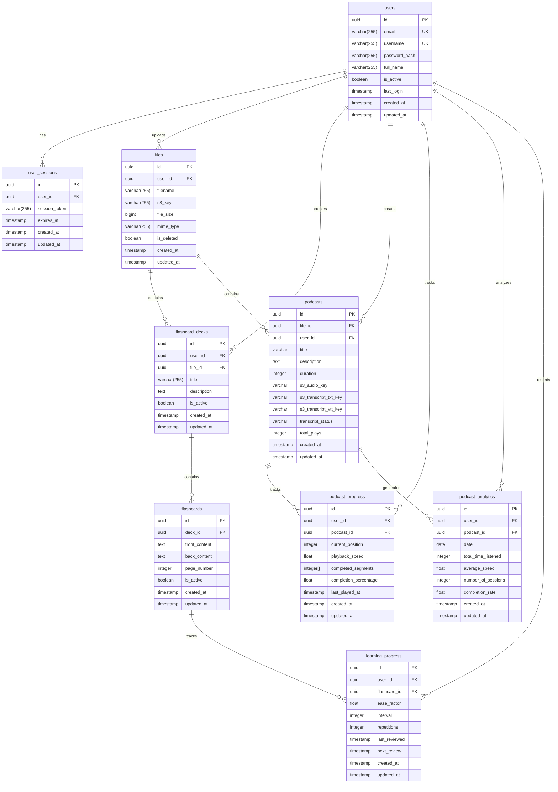

# LearnLab Database Documentation

## Table of Contents
1. [Database Schema Overview](#database-schema-overview)
2. [Table Specifications](#table-specifications)
3. [Database Indexing Strategy](#database-indexing-strategy)
4. [Automated Database Features](#automated-database-features)
5. [Views](#views)
6. [Helper Functions](#helper-functions)
7. [Constraints and Relationships](#constraints-and-relationships)
8. [Database Setup and Maintenance](#database-setup-and-maintenance)

## Database Schema Overview



## Table Specifications

### Core Tables

#### Users Table
```sql
CREATE TABLE users (
    id UUID PRIMARY KEY DEFAULT uuid_generate_v4(),
    email VARCHAR(255) UNIQUE NOT NULL,
    username VARCHAR(255) UNIQUE NOT NULL,
    password_hash VARCHAR(255) NOT NULL,
    full_name VARCHAR(255),
    is_active BOOLEAN DEFAULT true,
    last_login TIMESTAMP WITH TIME ZONE,
    created_at TIMESTAMP WITH TIME ZONE DEFAULT CURRENT_TIMESTAMP,
    updated_at TIMESTAMP WITH TIME ZONE DEFAULT CURRENT_TIMESTAMP
);
```

#### User Sessions Table
```sql
CREATE TABLE user_sessions (
    id UUID PRIMARY KEY DEFAULT uuid_generate_v4(),
    user_id UUID REFERENCES users(id) ON DELETE CASCADE,
    refresh_token VARCHAR(255) NOT NULL,
    expires_at TIMESTAMP WITH TIME ZONE NOT NULL,
    created_at TIMESTAMP WITH TIME ZONE DEFAULT CURRENT_TIMESTAMP,
    updated_at TIMESTAMP WITH TIME ZONE DEFAULT CURRENT_TIMESTAMP,
    device_info VARCHAR(255)
);
```

#### Files Table
```sql
CREATE TABLE files (
    id UUID PRIMARY KEY DEFAULT uuid_generate_v4(),
    user_id UUID REFERENCES users(id) ON DELETE CASCADE,
    filename VARCHAR(255) NOT NULL,
    s3_key VARCHAR(255) NOT NULL,
    file_size BIGINT,
    mime_type VARCHAR(255),
    is_deleted BOOLEAN DEFAULT false,
    created_at TIMESTAMP WITH TIME ZONE DEFAULT CURRENT_TIMESTAMP,
    updated_at TIMESTAMP WITH TIME ZONE DEFAULT CURRENT_TIMESTAMP
);
```

### Flashcard System Tables

#### Flashcard Decks Table
```sql
CREATE TABLE flashcard_decks (
    id UUID PRIMARY KEY DEFAULT uuid_generate_v4(),
    user_id UUID REFERENCES users(id) ON DELETE CASCADE,
    file_id UUID REFERENCES files(id) ON DELETE CASCADE,
    title VARCHAR(255) NOT NULL,
    description TEXT,
    is_active BOOLEAN DEFAULT true,
    created_at TIMESTAMP WITH TIME ZONE DEFAULT CURRENT_TIMESTAMP,
    updated_at TIMESTAMP WITH TIME ZONE DEFAULT CURRENT_TIMESTAMP,
    CONSTRAINT unique_active_deck_per_file UNIQUE NULLS NOT DISTINCT (file_id, is_active)
);
```

#### Flashcards Table
```sql
CREATE TABLE flashcards (
    id UUID PRIMARY KEY DEFAULT uuid_generate_v4(),
    deck_id UUID REFERENCES flashcard_decks(id) ON DELETE CASCADE,
    front_content TEXT NOT NULL,
    back_content TEXT NOT NULL,
    page_number INTEGER,
    is_active BOOLEAN DEFAULT true,
    created_at TIMESTAMP WITH TIME ZONE DEFAULT CURRENT_TIMESTAMP,
    updated_at TIMESTAMP WITH TIME ZONE DEFAULT CURRENT_TIMESTAMP
);
```

#### Learning Progress Table
```sql
CREATE TABLE learning_progress (
    id UUID PRIMARY KEY DEFAULT uuid_generate_v4(),
    user_id UUID REFERENCES users(id) ON DELETE CASCADE,
    flashcard_id UUID REFERENCES flashcards(id) ON DELETE CASCADE,
    ease_factor FLOAT DEFAULT 2.5,
    interval INTEGER DEFAULT 0,
    repetitions INTEGER DEFAULT 0,
    last_reviewed TIMESTAMP WITH TIME ZONE,
    next_review TIMESTAMP WITH TIME ZONE,
    created_at TIMESTAMP WITH TIME ZONE DEFAULT CURRENT_TIMESTAMP,
    updated_at TIMESTAMP WITH TIME ZONE DEFAULT CURRENT_TIMESTAMP
);
```

### Podcast System Tables

#### Podcasts Table
```sql
CREATE TABLE podcasts (
    id UUID PRIMARY KEY DEFAULT uuid_generate_v4(),
    file_id UUID REFERENCES files(id) ON DELETE CASCADE,
    user_id UUID REFERENCES users(id) ON DELETE CASCADE,
    title VARCHAR(255) NOT NULL,
    description TEXT,
    duration INTEGER NOT NULL,
    s3_audio_key VARCHAR(255) NOT NULL,
    s3_transcript_txt_key VARCHAR(255) NOT NULL,
    s3_transcript_vtt_key VARCHAR(255),
    transcript_status VARCHAR(50) DEFAULT 'txt_only',
    total_plays INTEGER DEFAULT 0,
    created_at TIMESTAMP WITH TIME ZONE DEFAULT CURRENT_TIMESTAMP,
    updated_at TIMESTAMP WITH TIME ZONE DEFAULT CURRENT_TIMESTAMP
);
```

#### Podcast Progress Table
```sql
CREATE TABLE podcast_progress (
    id UUID PRIMARY KEY DEFAULT uuid_generate_v4(),
    user_id UUID REFERENCES users(id) ON DELETE CASCADE,
    podcast_id UUID REFERENCES podcasts(id) ON DELETE CASCADE,
    current_position INTEGER DEFAULT 0,
    playback_speed FLOAT DEFAULT 1.0,
    completed_segments INTEGER[],
    completion_percentage FLOAT DEFAULT 0.0,
    last_played_at TIMESTAMP WITH TIME ZONE,
    created_at TIMESTAMP WITH TIME ZONE DEFAULT CURRENT_TIMESTAMP,
    updated_at TIMESTAMP WITH TIME ZONE DEFAULT CURRENT_TIMESTAMP
);
```

#### Podcast Analytics Table
```sql
CREATE TABLE podcast_analytics (
    id UUID PRIMARY KEY DEFAULT uuid_generate_v4(),
    user_id UUID REFERENCES users(id) ON DELETE CASCADE,
    podcast_id UUID REFERENCES podcasts(id) ON DELETE CASCADE,
    date DATE NOT NULL,
    total_time_listened INTEGER DEFAULT 0,
    average_speed FLOAT DEFAULT 1.0,
    number_of_sessions INTEGER DEFAULT 0,
    completion_rate FLOAT DEFAULT 0.0,
    created_at TIMESTAMP WITH TIME ZONE DEFAULT CURRENT_TIMESTAMP,
    updated_at TIMESTAMP WITH TIME ZONE DEFAULT CURRENT_TIMESTAMP
);
```

## Database Indexing Strategy

### Core Table Indexes
```sql
-- User-related indexes
CREATE INDEX idx_users_email ON users(email);
CREATE INDEX idx_users_username ON users(username);

-- File-related indexes
CREATE INDEX idx_files_user_id ON files(user_id);
CREATE INDEX idx_files_is_deleted ON files(is_deleted);

-- Session-related indexes
CREATE INDEX idx_user_sessions_user_id ON user_sessions(user_id);
CREATE INDEX idx_user_sessions_expires_at ON user_sessions(expires_at);
```

### Flashcard System Indexes
```sql
-- Flashcard deck indexes
CREATE INDEX idx_flashcard_decks_user_id ON flashcard_decks(user_id);
CREATE INDEX idx_flashcard_decks_file_id ON flashcard_decks(file_id);
CREATE INDEX idx_flashcard_decks_is_active ON flashcard_decks(is_active);

-- Flashcard indexes
CREATE INDEX idx_flashcards_deck_id ON flashcards(deck_id);
CREATE INDEX idx_flashcards_is_active ON flashcards(is_active);
CREATE INDEX idx_flashcards_page_number ON flashcards(page_number);

-- Learning progress indexes
CREATE INDEX idx_learning_progress_user_id ON learning_progress(user_id);
CREATE INDEX idx_learning_progress_flashcard_id ON learning_progress(flashcard_id);
CREATE INDEX idx_learning_progress_next_review ON learning_progress(next_review);
```

### Podcast System Indexes
```sql
-- Podcast indexes
CREATE INDEX idx_podcasts_user_id ON podcasts(user_id);
CREATE INDEX idx_podcasts_file_id ON podcasts(file_id);

-- Podcast progress indexes
CREATE INDEX idx_podcast_progress_user_id ON podcast_progress(user_id);
CREATE INDEX idx_podcast_progress_podcast_id ON podcast_progress(podcast_id);

-- Podcast analytics indexes
CREATE INDEX idx_podcast_analytics_user_id ON podcast_analytics(user_id);
CREATE INDEX idx_podcast_analytics_podcast_id ON podcast_analytics(podcast_id);
CREATE INDEX idx_podcast_analytics_date ON podcast_analytics(date);
```

## Automated Database Features

### Automatic Timestamp Updates
```sql
-- Trigger function for updating timestamps
CREATE OR REPLACE FUNCTION update_updated_at_column()
RETURNS TRIGGER AS $$
BEGIN
    NEW.updated_at = CURRENT_TIMESTAMP;
    RETURN NEW;
END;
$$ language 'plpgsql';

-- Apply trigger to all tables with updated_at
CREATE TRIGGER update_users_updated_at
    BEFORE UPDATE ON users
    FOR EACH ROW
    EXECUTE FUNCTION update_updated_at_column();

-- Similar triggers for all other tables
CREATE TRIGGER update_files_updated_at
    BEFORE UPDATE ON files
    FOR EACH ROW
    EXECUTE FUNCTION update_updated_at_column();

-- ... (triggers for remaining tables)
```

## Views

### Flashcard System Views

#### User Study Statistics
```sql
CREATE OR REPLACE VIEW user_study_stats AS
SELECT 
    u.id as user_id,
    u.email,
    u.username,
    COUNT(DISTINCT fd.id) as total_decks,
    COUNT(DISTINCT f.id) as total_cards,
    COUNT(DISTINCT fd.file_id) as files_with_decks,
    COALESCE(AVG(lp.ease_factor), 2.5) as avg_performance
FROM users u
LEFT JOIN flashcard_decks fd ON u.id = fd.user_id AND fd.is_active = true
LEFT JOIN flashcards f ON fd.id = f.deck_id AND f.is_active = true
LEFT JOIN learning_progress lp ON f.id = lp.flashcard_id
GROUP BY u.id, u.email, u.username;
```

#### Due Cards View
```sql
CREATE OR REPLACE VIEW due_cards_view AS
SELECT 
    lp.user_id,
    fd.id as deck_id,
    fd.title as deck_title,
    f.file_id,
    COUNT(*) as due_cards_count
FROM learning_progress lp
JOIN flashcards f ON lp.flashcard_id = f.id AND f.is_active = true
JOIN flashcard_decks fd ON f.deck_id = fd.id AND fd.is_active = true
WHERE lp.next_review <= CURRENT_TIMESTAMP
GROUP BY lp.user_id, fd.id, fd.title, f.file_id;
```

### Podcast System Views

#### User Podcast Statistics
```sql
CREATE OR REPLACE VIEW user_podcast_stats AS
SELECT 
    u.id as user_id,
    u.username,
    COUNT(DISTINCT p.id) as total_podcasts,
    SUM(p.duration) as total_content_duration,
    AVG(pa.completion_rate) as avg_completion_rate,
    AVG(pa.average_speed) as avg_playback_speed,
    SUM(pa.total_time_listened) as total_time_listened
FROM users u
LEFT JOIN podcasts p ON u.id = p.user_id
LEFT JOIN podcast_analytics pa ON p.id = pa.podcast_id
GROUP BY u.id, u.username;
```

#### Podcast Engagement Statistics
```sql
CREATE OR REPLACE VIEW podcast_engagement_stats AS
SELECT 
    p.id as podcast_id,
    p.title,
    COUNT(DISTINCT pp.user_id) as unique_listeners,
    AVG(pp.completion_percentage) as avg_completion,
    p.total_plays,
    COUNT(DISTINCT pa.date) as days_accessed
FROM podcasts p
LEFT JOIN podcast_progress pp ON p.id = pp.podcast_id
LEFT JOIN podcast_analytics pa ON p.id = pa.podcast_id
GROUP BY p.id, p.title, p.total_plays;
```

## Helper Functions

### Flashcard System Functions

#### Deck Statistics Function
```sql
CREATE OR REPLACE FUNCTION get_deck_statistics(deck_id_param UUID)
RETURNS TABLE (
    total_cards INTEGER,
    mastered_cards INTEGER,
    learning_cards INTEGER,
    mastery_percentage NUMERIC,
    distinct_pages INTEGER
) AS $
BEGIN
    RETURN QUERY
    SELECT 
        COUNT(DISTINCT f.id)::INTEGER as total_cards,
        COUNT(DISTINCT CASE WHEN lp.interval >= 21 THEN f.id END)::INTEGER as mastered_cards,
        COUNT(DISTINCT CASE WHEN lp.interval < 21 THEN f.id END)::INTEGER as learning_cards,
        ROUND(COUNT(DISTINCT CASE WHEN lp.interval >= 21 THEN f.id END)::NUMERIC / 
              NULLIF(COUNT(DISTINCT f.id), 0) * 100, 2) as mastery_percentage,
        COUNT(DISTINCT f.page_number)::INTEGER as distinct_pages
    FROM flashcards f
    LEFT JOIN learning_progress lp ON f.id = lp.flashcard_id
    WHERE f.deck_id = deck_id_param
    AND f.is_active = true;
END;
$ LANGUAGE plpgsql;

### Podcast System Functions

#### Podcast Statistics Function
```sql
CREATE OR REPLACE FUNCTION get_podcast_statistics(podcast_id_param UUID)
RETURNS TABLE (
    total_listeners INTEGER,
    average_completion FLOAT,
    total_listening_time INTEGER,
    average_speed FLOAT,
    engagement_score FLOAT
) AS $
BEGIN
    RETURN QUERY
    SELECT 
        COUNT(DISTINCT pp.user_id)::INTEGER as total_listeners,
        AVG(pp.completion_percentage)::FLOAT as average_completion,
        SUM(pa.total_time_listened)::INTEGER as total_listening_time,
        AVG(pa.average_speed)::FLOAT as average_speed,
        (COUNT(DISTINCT pp.user_id) * AVG(pp.completion_percentage) / 100.0)::FLOAT as engagement_score
    FROM podcasts p
    LEFT JOIN podcast_progress pp ON p.id = pp.podcast_id
    LEFT JOIN podcast_analytics pa ON p.id = pa.podcast_id
    WHERE p.id = podcast_id_param;
END;
$ LANGUAGE plpgsql;

## Constraints and Relationships

### Unique Constraints
1. **Users Table**
   - Email address (email)
   - Username (username)
2. **Flashcard Decks Table**
   - Active deck per file (file_id, is_active)
3. **User Sessions Table**
   - Refresh token (user_id, refresh_token)

### Foreign Key Relationships
All foreign key relationships use CASCADE delete for maintaining referential integrity.

1. **Core Relations**
   - User Sessions → Users (user_id)
   - Files → Users (user_id)

2. **Flashcard System Relations**
   - Flashcard Decks → Users (user_id)
   - Flashcard Decks → Files (file_id)
   - Flashcards → Flashcard Decks (deck_id)
   - Learning Progress → Users (user_id)
   - Learning Progress → Flashcards (flashcard_id)

3. **Podcast System Relations**
   - Podcasts → Users (user_id)
   - Podcasts → Files (file_id)
   - Podcast Progress → Users (user_id)
   - Podcast Progress → Podcasts (podcast_id)
   - Podcast Analytics → Users (user_id)
   - Podcast Analytics → Podcasts (podcast_id)

### Default Values

1. **Universal Defaults**
   - Primary Keys: uuid_generate_v4()
   - Timestamps: CURRENT_TIMESTAMP
   - Boolean Flags: false/true as appropriate

2. **System-Specific Defaults**
   - Learning Progress:
     - ease_factor: 2.5
     - interval: 0
     - repetitions: 0
   - Podcast Progress:
     - current_position: 0
     - playback_speed: 1.0
     - completion_percentage: 0.0
   - Podcast Analytics:
     - total_time_listened: 0
     - average_speed: 1.0
     - number_of_sessions: 0
     - completion_rate: 0.0

## Database Setup and Maintenance

### Initial Setup
```sql
-- Enable UUID extension
CREATE EXTENSION IF NOT EXISTS "uuid-ossp";

-- Run initialization script
\i init.sql

-- Verify setup
\dt  -- List all tables
\dv  -- List all views
\df  -- List all functions
```

### Maintenance Tasks

1. **Regular Maintenance**
```sql
-- Analyze tables for query optimization
ANALYZE users, files, flashcard_decks, flashcards, learning_progress, 
        podcasts, podcast_progress, podcast_analytics;

-- Update table statistics
VACUUM ANALYZE;
```

2. **Index Maintenance**
```sql
-- Reindex specific tables
REINDEX TABLE users;
REINDEX TABLE files;
-- ... (other tables)

-- Reindex entire database
REINDEX DATABASE learnlab;
```

3. **Data Cleanup**
```sql
-- Archive old sessions
DELETE FROM user_sessions WHERE expires_at < NOW() - INTERVAL '30 days';

-- Clean up soft-deleted files
DELETE FROM files WHERE is_deleted = true AND updated_at < NOW() - INTERVAL '30 days';
```

4. **Backup Procedures**
```bash
# Full database backup
pg_dump -U postgres learnlab > backup_$(date +%Y%m%d).sql

# Restore from backup
psql -U postgres learnlab < backup_20241204.sql
```

This completes the comprehensive documentation of the LearnLab database system.