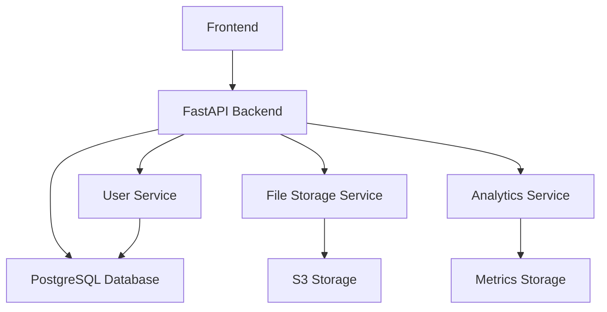
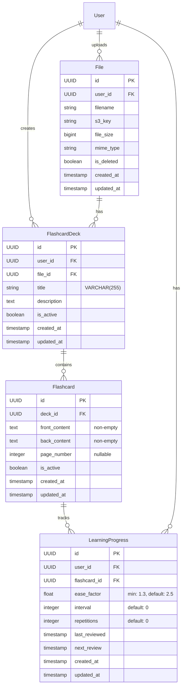

# LearnLab Flashcards System Documentation

## Table of Contents
- [Overview](#overview)
- [System Architecture](#system-architecture)
- [Database Design](#database-design)
- [File Integration](#file-integration)
- [Services Implementation](#services-implementation)
- [API Routes](#api-routes)
- [Analytics & Metrics](#analytics--metrics)
- [Spaced Repetition Algorithm](#spaced-repetition-algorithm)
- [Frontend Implementation Guide](#frontend-implementation-guide)
- [Testing](#testing)
- [Development Setup](#development-setup)

## Overview

The LearnLab Flashcards System implements a comprehensive spaced repetition learning system integrated with file-based learning. Each flashcard deck is associated with a specific file (e.g., PDF, document) allowing users to create focused study materials directly related to their learning resources.

### Key Features
- File-based flashcard deck creation
- Spaced repetition learning system (SM-2 algorithm)
- Page-specific flashcard references
- Comprehensive learning analytics
- Study scheduling and optimization
- Performance tracking and insights
- Multi-user support with isolation

## System Architecture

### Components Overview


### Technology Stack
- **Backend**: FastAPI + Python 3.9+
- **Database**: PostgreSQL
- **File Storage**: AWS S3
- **ORM**: SQLAlchemy
- **Migrations**: Alembic
- **Testing**: pytest

## Database Design

### Entity Relationship Diagram


## File Integration

### Model Properties and Methods

#### FlashcardDeck
```python
class FlashcardDeck:
    @hybrid_property
    def active_cards_count(self) -> int:
        """Get count of active cards in deck"""

    @hybrid_property
    def mastery_percentage(self) -> float:
        """Calculate mastery percentage of deck"""

    def get_due_cards(self, user_id: UUID) -> List[Flashcard]:
        """Get all due cards for a user"""
```

#### Flashcard
```python
class Flashcard:
    @hybrid_property
    def is_mastered(self) -> bool:
        """Card is considered mastered if interval >= 21 days"""

    def is_due(self, user_id: UUID) -> bool:
        """Check if card is due for review"""

    def get_progress(self, user_id: UUID) -> Optional[LearningProgress]:
        """Get user-specific learning progress"""
```

#### LearningProgress
```python
class LearningProgress:
    @hybrid_property
    def is_due(self) -> bool:
        """Check if review is due"""

    @hybrid_property
    def days_until_review(self) -> Optional[int]:
        """Get days until next review"""

    @hybrid_property
    def performance_level(self) -> str:
        """
        Returns performance level based on ease factor:
        - Excellent: >= 2.5
        - Good: >= 2.1
        - Fair: >= 1.7
        - Needs Review: < 1.7
        """
```

### Schema Types

#### Response Models

1. DeckWithFile (Complete deck info with file details)
```python
class DeckWithFile:
    id: UUID
    user_id: UUID
    file_id: UUID
    title: str
    description: Optional[str]
    is_active: bool
    created_at: datetime
    updated_at: datetime
    file_name: str
    file_type: str
    file_url: str
```

2. FileLearningStatus (File study progress)
```python
class FileLearningStatus:
    has_deck: bool
    deck_id: Optional[UUID]
    total_cards: int
    mastery_percentage: float
    last_reviewed: Optional[datetime]
```

3. DeckProgress (Detailed deck statistics)
```python
class DeckProgress:
    total_cards: int
    mastered_cards: int
    learning_cards: int
    mastery_percentage: float
    pages_covered: List[int]
```

4. UserStats (Overall user statistics)
```python
class UserStats:
    total_decks: int
    total_cards: int
    monthly_reviews: int
    cards_due: int
    average_performance: float
    files_with_decks: int
```

## API Routes

### Response Models per Endpoint

```python
# Deck Operations
POST /flashcards/decks/ -> DeckWithFile
GET /flashcards/decks/ -> List[DeckWithFile]
GET /flashcards/decks/{deck_id} -> DeckWithFile
PUT /flashcards/decks/{deck_id} -> DeckWithFile
DELETE /flashcards/decks/{deck_id} -> {"message": "Deck deleted successfully"}

# Flashcard Operations
POST /flashcards/decks/{deck_id}/cards/ -> FlashcardInDB
GET /flashcards/decks/{deck_id}/cards/page/{page_number} -> List[FlashcardInDB]
PUT /flashcards/cards/{card_id} -> FlashcardInDB
DELETE /flashcards/cards/{card_id} -> {"message": "Card deleted successfully"}

# Review Operations
POST /flashcards/cards/{card_id}/review -> ReviewResponse
GET /flashcards/study -> List[FlashcardInDB]

# Analytics
GET /flashcards/stats -> UserStats
GET /flashcards/decks/{deck_id}/progress -> DeckProgress
GET /files/{file_id}/learning-status -> FileLearningStatus
```

## Analytics & Metrics

### User Statistics
- Total active decks and cards
- Monthly review count and current due cards
- Average performance score (based on ease factors)
- Number of files with active learning decks

### Deck Progress Metrics
- Total, mastered, and learning cards counts
- Overall mastery percentage
- Pages covered with flashcards
- Review progress tracking

### Learning Analytics
- Per-card mastery status (interval >= 21 days)
- Performance levels (Excellent, Good, Fair, Needs Review)
- Page-specific coverage and performance
- Review scheduling and intervals

## Spaced Repetition Algorithm

The system implements the SuperMemo SM-2 algorithm with the following specifics:

1. Quality Ratings (0-5)
   - Quality < 3: Reset repetitions and interval to 1
   - Quality >= 3: Progress through intervals

2. Interval Progression
   - First successful review (repetitions = 0): 1 day
   - Second successful review (repetitions = 1): 6 days
   - Subsequent reviews: interval * ease_factor

3. Ease Factor Adjustment
   ```python
   ease_factor += (0.1 - (5 - quality) * (0.08 + (5 - quality) * 0.02))
   ease_factor = max(1.3, ease_factor)  # Minimum ease factor is 1.3
   ```

4. Mastery Definition
   - A card is considered mastered when its interval reaches 21 days
   - Progress tracking uses this threshold for analytics
