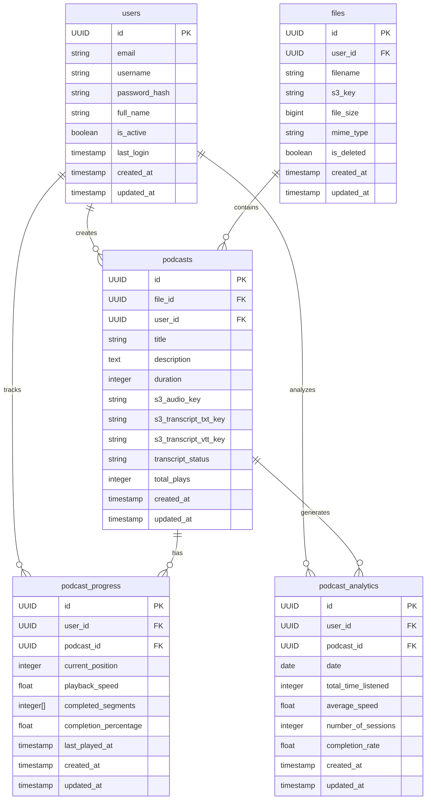
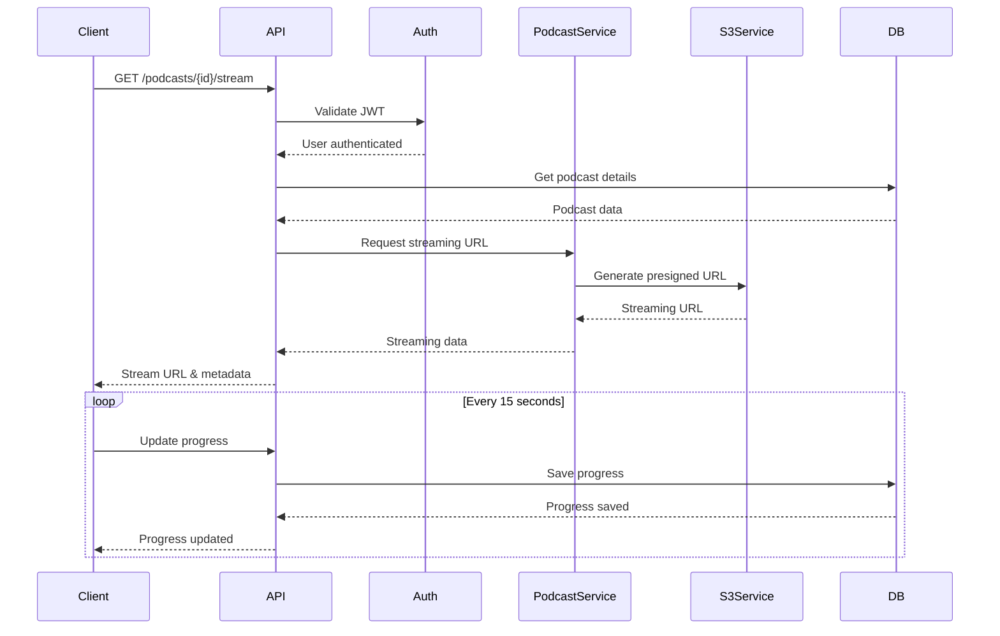

# LearnLab Podcast Streaming System Design

## 1. System Overview

The podcast streaming system integrates with the existing LearnLab platform to provide audio content and transcript streaming capabilities. The system allows users to:
- Upload podcast files with transcripts
- Stream audio with variable playback speeds
- Track listening progress
- View synchronized transcripts
- Get learning analytics

## 2. Database Schema Design



## 3. Project Structure

```
app/
├── services/
│   ├── podcast_service/
│   │   ├── __init__.py           # Exports all service functions
│   │   ├── audio.py              # Audio handling and streaming
│   │   ├── transcript.py         # Transcript processing
│   │   ├── progress.py           # Progress tracking
│   │   └── analytics.py          # Analytics processing
│   └── __init__.py
├── models/
│   ├── podcast/
│   │   ├── __init__.py           # Exports all models
│   │   ├── podcast.py            # Podcast model
│   │   ├── progress.py           # Progress tracking model
│   │   └── analytics.py          # Analytics model
│   └── __init__.py
├── schemas/
│   ├── podcast/
│   │   ├── __init__.py           # Exports all schemas
│   │   ├── podcast.py            # Podcast Pydantic schemas
│   │   ├── progress.py           # Progress schemas
│   │   └── analytics.py          # Analytics schemas
│   └── __init__.py
└── api/
    └── v1/
        └── podcasts/
            ├── __init__.py       # Route exports
            ├── podcast.py        # Podcast endpoints
            ├── progress.py       # Progress endpoints
            └── analytics.py      # Analytics endpoints
```

## 4. Service Layer Design

### 4.1 Audio Service Interface
```python
class IAudioService(Protocol):
    async def upload_podcast(
        self, 
        file: UploadFile, 
        user_id: UUID,
        validate_duration: bool = True
    ) -> tuple[str, int]: ...
    
    async def get_streaming_url(
        self, 
        s3_key: str, 
        start_position: int = 0
    ) -> str: ...
    
    async def validate_audio_format(
        self, 
        file: UploadFile
    ) -> bool: ...
    
    async def get_audio_duration(
        self, 
        file: UploadFile
    ) -> int: ...
```

### 4.2 Transcript Service Interface
```python
class ITranscriptService(Protocol):
    async def process_transcript(
        self,
        file: UploadFile,
        user_id: UUID,
        format: str = 'txt'
    ) -> dict: ...
    
    async def convert_to_vtt(
        self,
        text_content: str
    ) -> str: ...
    
    async def get_transcript_url(
        self,
        s3_key: str
    ) -> str: ...
```

### 4.3 Progress Service Interface
```python
class IProgressService(Protocol):
    async def update_progress(
        self,
        user_id: UUID,
        podcast_id: UUID,
        position: int,
        speed: float = 1.0
    ) -> PodcastProgress: ...
    
    async def get_progress(
        self,
        user_id: UUID,
        podcast_id: UUID
    ) -> PodcastProgress: ...
    
    def calculate_completion(
        self,
        duration: int,
        position: int
    ) -> float: ...
```

## 5. Streaming Flow



## 6. API Endpoints

### 6.1 Podcast Management

#### Create Podcast
```python
@router.post("/")
async def create_podcast(
    *,
    db: Session = Depends(get_db),
    current_user: User = Depends(get_current_active_user),
    file_id: UUID = Form(...),
    title: str = Form(...),
    description: str = Form(None),
    audio_file: UploadFile = File(...),
    transcript_file: UploadFile = File(...),
) -> PodcastCreate
```

#### Get Podcast
```python
@router.get("/{podcast_id}")
async def get_podcast(
    *,
    db: Session = Depends(get_db),
    current_user: User = Depends(get_current_active_user),
    podcast_id: UUID,
) -> PodcastDetail
```

#### Stream Podcast
```python
@router.get("/{podcast_id}/stream")
async def stream_podcast(
    *,
    db: Session = Depends(get_db),
    current_user: User = Depends(get_current_active_user),
    podcast_id: UUID,
    position: int = Query(0),
) -> StreamingResponse
```

### 6.2 Progress Tracking

#### Update Progress
```python
@router.patch("/{podcast_id}/progress")
async def update_progress(
    *,
    db: Session = Depends(get_db),
    current_user: User = Depends(get_current_active_user),
    podcast_id: UUID,
    position: int,
    speed: float = 1.0,
) -> PodcastProgress
```

#### Get Progress
```python
@router.get("/{podcast_id}/progress")
async def get_progress(
    *,
    db: Session = Depends(get_db),
    current_user: User = Depends(get_current_active_user),
    podcast_id: UUID,
) -> PodcastProgress
```

### 6.3 Analytics

#### Get User Analytics
```python
@router.get("/analytics/user")
async def get_user_analytics(
    *,
    db: Session = Depends(get_db),
    current_user: User = Depends(get_current_active_user),
) -> UserPodcastAnalytics
```

## 7. Frontend Components

### 7.1 Audio Player Component
```typescript
interface PodcastPlayerProps {
    podcastId: string;
    initialPosition: number;
    initialSpeed: number;
    onProgressUpdate: (position: number, speed: number) => void;
}

interface PlayerState {
    isPlaying: boolean;
    currentTime: number;
    buffered: TimeRanges;
    duration: number;
    speed: number;
}

const useAudioPlayer = (podcastId: string) => {
    // Custom hook implementation
};

const PodcastPlayer: React.FC<PodcastPlayerProps> = ({
    podcastId,
    initialPosition,
    initialSpeed,
    onProgressUpdate,
}) => {
    // Component implementation
};
```

### 7.2 Transcript Viewer Component
```typescript
interface TranscriptViewerProps {
    transcriptUrl: string;
    currentTime: number;
    onTimeClick: (time: number) => void;
}

interface TranscriptLine {
    startTime: number;
    endTime: number;
    text: string;
}

const useTranscript = (url: string) => {
    // Custom hook implementation
};

const TranscriptViewer: React.FC<TranscriptViewerProps> = ({
    transcriptUrl,
    currentTime,
    onTimeClick,
}) => {
    // Component implementation
};
```

## 8. Implementation Details

### 8.1 Audio Processing
- Format validation
- Duration extraction
- Chunk-based streaming
- Range request support

### 8.2 Progress Tracking
- 15-second interval updates
- Segment tracking (15-second segments)
- Progress persistence
- Resume functionality

### 8.3 Analytics Processing
- Daily aggregation
- Learning streak calculation
- Session tracking
- Performance metrics

### 8.4 Transcript Processing
- Format validation
- Text to VTT conversion
- Synchronization with audio
- Search functionality (future)

## 9. Technical Considerations

### 9.1 Security
- JWT authentication
- S3 presigned URLs
- Progress validation
- Rate limiting

### 9.2 Performance
- Audio buffering
- Transcript caching
- Progress batch updates
- Analytics aggregation

### 9.3 Scalability
- S3 for storage
- Database indexing
- Caching strategy
- Connection pooling

## 10. Future Enhancements

1. WebVTT Support
   - Implementation plan
   - Migration strategy

2. Search Functionality
   - Full-text search
   - Metadata indexing

3. Social Features
   - Comments
   - Sharing
   - Bookmarks

4. Advanced Analytics
   - Learning patterns
   - Recommendations
   - Progress insights

Would you like me to elaborate on any specific section or add more details to any part of the design?